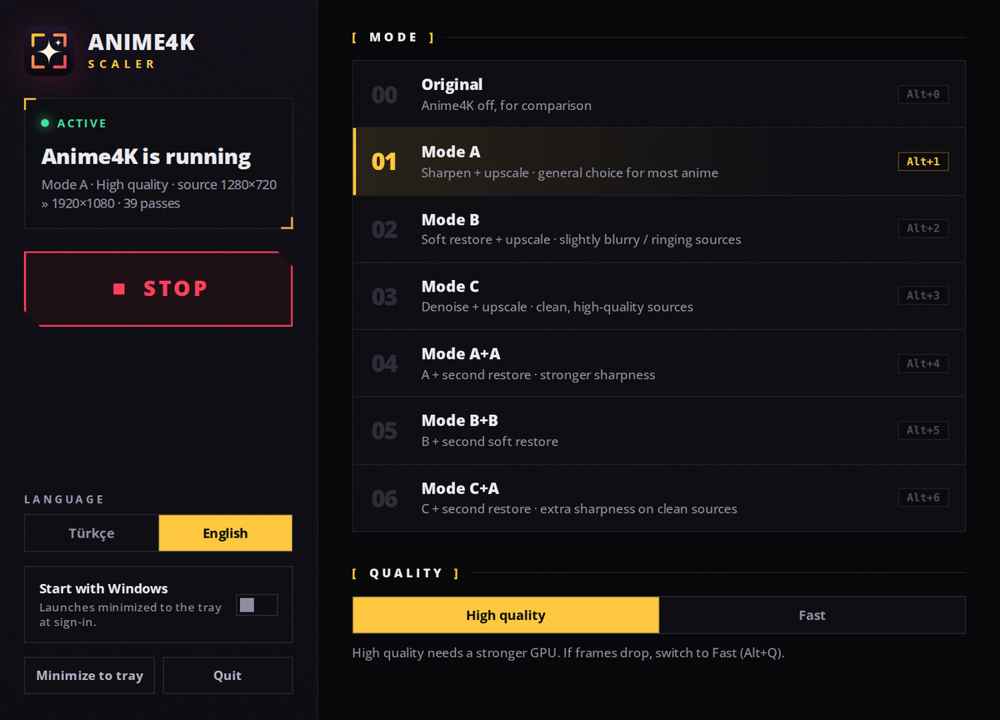
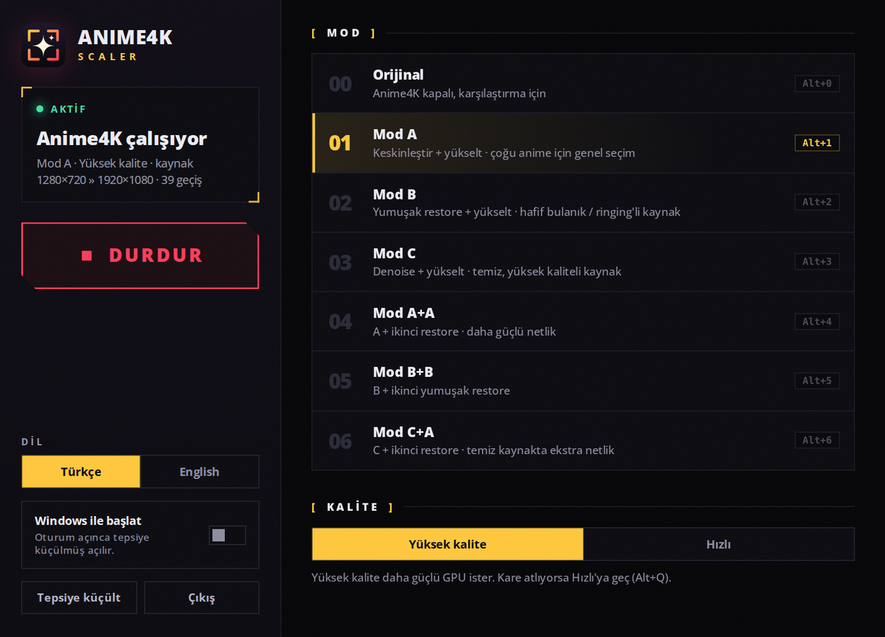

<div align="center">


# Anime4K Scaler

**Real-time [Anime4K](https://github.com/bloc97/Anime4K) upscaling for any fullscreen video on Windows. No downloads, no mpv.**


[**English**](#english) · [**Türkçe**](#türkçe)

</div>

---

## English

Anime4K is a set of high-quality, real-time anime upscaling and restoration shaders. Normally you need to download the video and play it in mpv to use them. **Anime4K Scaler** applies the official **v4.0** shaders to *anything* you watch fullscreen: a browser streaming site, a media player, whatever. Just press **Start**, then make a video fullscreen.

<p align="center"></p>

### Features

- **Works on any fullscreen window.** Browsers, VLC, MPC-HC, PotPlayer, and so on. Nothing to download or open in a special player.
- **All official modes:** A, B, C, A+A, B+B, C+A, each in *High quality* and *Fast* variants, plus an *Original* view for A/B comparison.
- **Automatic.** After you press **Start** it waits for a fullscreen window, scales it, and turns off when you leave fullscreen.
- **Hotkeys while watching:** switch modes with `Alt+1…6` and toggle everything with `F9`, without leaving fullscreen.
- **GPU-only pipeline.** DXGI Desktop Duplication capture, Direct3D 11 shaders, click-through overlay. Mouse and keyboard still go to your player.

### How it works

1. A fullscreen foreground window is detected (its rectangle equals the monitor's).
2. The monitor is captured on the GPU with **DXGI Desktop Duplication**.
3. The Anime4K shaders (mpv `.glsl` hooks) are parsed at startup, translated to **HLSL**, compiled (and cached on disk), and run as Direct3D 11 pixel shader passes.
4. The result is shown in a borderless, click-through, topmost overlay that is **excluded from capture**, so it never captures itself.

### Quick start

1. Install the requirements below and build (or grab a release build).
2. Run `Anime4KScaler.exe`, pick a **mode**, set the **source resolution** (see below), and press **Start** (or `F9`).
3. Make a video fullscreen. Scaling starts automatically.
4. Close the window to keep it running in the tray.

### Set the source resolution!

In fullscreen the browser or player has already stretched the video to your screen size, so what gets captured is a blurry upscale. Anime4K needs to work from the video's *real* size, so the app first scales the capture back down to the **source resolution** you choose, then upscales it with Anime4K.

| Your video | Pick |
|---|---|
| 480p | `480p` |
| 720p (most common) | `720p` (default) |
| 1080p on a 1440p/4K screen | `1080p` |
| Don't want any pre-scaling | `Screen` |

Cycle it quickly with `F10`. If the source is the same size as your screen (for example 1080p on a 1080p monitor), there is nothing to upscale and only the restore steps run.

### Modes

All modes include Clamp Highlights and the automatic downscale steps. *Fast* swaps the heavy networks (VL) for lighter ones (M / S).

| Mode | Pipeline | Typical use |
|---|---|---|
| **A** | Restore → Upscale | General choice for most anime |
| **B** | Soft Restore → Upscale | Slightly blurry or ringing sources |
| **C** | Upscale + Denoise | Clean, high-quality sources |
| **A+A** | A + a second Restore | Stronger sharpness |
| **B+B** | B + a second Soft Restore | Soft look with extra cleanup |
| **C+A** | C + a Restore pass | Extra sharpness on clean sources |

### Hotkeys

| Key | Action |
|---|---|
| `F9` | Start / Stop |
| `Alt+1` … `Alt+6` | Mode A, B, C, A+A, B+B, C+A |
| `Alt+0` | Original image (compare) |
| `Alt+Q` | Toggle High quality / Fast |
| `F10` | Cycle source resolution |

`Alt+digit` and `F10` are registered system-wide only while scaling is active, so they don't interfere with other apps the rest of the time.

### Requirements

**To run (end users)**

- Windows 10 version 2004 (build 19041) or newer, x64
- A DirectX 11 capable GPU (heavier modes need a stronger one)
- [Microsoft Edge WebView2 Runtime](https://developer.microsoft.com/microsoft-edge/webview2/) for the UI. It is already included in Windows 11 and on most up-to-date Windows 10 systems, so you usually don't need to install anything. If it's missing, the app tells you and shows the download link.
- The [.NET 8 Desktop Runtime](https://dotnet.microsoft.com/download/dotnet/8.0) **only if** the build you downloaded is the small framework-dependent one. Self-contained builds already include .NET and need nothing extra.

**To build (developers)**

- The [.NET 8 SDK](https://dotnet.microsoft.com/download/dotnet/8.0)

### Build from source

```bash
git clone <this-repo-url>
cd Anime4KScaler
dotnet build -c Release
# small publish folder (users need the .NET 8 Desktop Runtime):
dotnet publish -c Release -r win-x64 --self-contained false
# or a self-contained folder for releases (users need no .NET install, larger download):
dotnet publish -c Release -r win-x64 --self-contained true
```

NuGet packages (restored automatically): `SharpDX`, `SharpDX.DXGI`, `SharpDX.Direct3D11`, `SharpDX.D3DCompiler`, `Microsoft.Web.WebView2`.

The first time you pick a mode, the shaders are compiled, which can take a few seconds. They are cached in `%LocalAppData%\Anime4KScaler\cache`, so later starts are instant.

### Files and settings

| What | Where |
|---|---|
| Settings (mode, quality, source, language, last state) | `%AppData%\Anime4KScaler\config.json` |
| Shader cache | `%LocalAppData%\Anime4KScaler\cache` |
| Anime4K shaders | `Shaders\` (next to the exe) |
| UI | `Ui\index.html` (next to the exe) |

### Limitations and troubleshooting

- **DRM-protected video** (hardware DRM, e.g. some streaming apps) appears black in any screen capture. Browser playback of most anime sites works fine.
- **Every fullscreen window is scaled, including games.** Press `F9` to stop it when you don't want it.
- **HDR** is not tested.
- **Another capture app** holding the screen (some recorders) can stop capture from starting. Close it and press Start again.
- **Frames dropping?** Switch to *Fast* (`Alt+Q`) or a lighter mode (A, B, C).
- **The overlay needs Windows 10 2004+** because it relies on the "exclude from capture" window flag.
- **UI does not open?** Install the WebView2 Runtime (link above).

### Credits and license

- [**Anime4K**](https://github.com/bloc97/Anime4K) by **bloc97**. The shaders in `Shaders/` are his work, used under their MIT license.
- Inspired by the way mpv applies user shaders. This app implements a small subset of the mpv hook format (`HOOK`, `BIND`, `SAVE`, `WIDTH`, `HEIGHT`, `WHEN`) just for Anime4K.
- UI font: [Open Sans](https://fonts.google.com/specimen/Open+Sans) (SIL Open Font License).
- This project is released under the **MIT License** (see [LICENSE](LICENSE)).

---

## Türkçe

Anime4K, anime için gerçek zamanlı çalışan yüksek kaliteli büyütme ve iyileştirme shader'larıdır. Normalde kullanmak için videoyu indirip mpv'de oynatmak gerekir. **Anime4K Scaler**, resmi **v4.0** shader'larını tam ekran izlediğin *her şeye* uygular: tarayıcıdaki bir yayın sitesi, bir medya oynatıcı, fark etmez. **Başlat**'a bas, sonra bir videoyu tam ekran yap.

<p align="center"></p>

### Özellikler

- **Her tam ekran pencerede çalışır.** Tarayıcılar, VLC, MPC-HC, PotPlayer vb. İndirmek ya da özel bir oynatıcıda açmak gerekmez.
- **Tüm resmi modlar:** A, B, C, A+A, B+B, C+A; hepsi *Yüksek kalite* ve *Hızlı* seçenekleriyle. Karşılaştırma için *Orijinal* görünümü de var.
- **Otomatik.** **Başlat**'a basınca tam ekran pencere bekler, ölçekler, tam ekrandan çıkınca kapanır.
- **İzlerken kısayollar:** `Alt+1…6` ile mod değiştir, `F9` ile hepsini aç/kapat; tam ekrandan çıkmana gerek yok.
- **Tamamen GPU üzerinde.** DXGI Desktop Duplication yakalama, Direct3D 11 shader'ları, tıklamayı geçiren overlay. Fare ve klavye oynatıcına gitmeye devam eder.

### Nasıl çalışır?

1. Ön plandaki tam ekran pencere algılanır (penceresinin boyutu monitörle aynıdır).
2. Monitör, **DXGI Desktop Duplication** ile GPU üzerinde yakalanır.
3. Anime4K shader'ları (mpv `.glsl` hook'ları) açılışta ayrıştırılır, **HLSL**'e çevrilir, derlenir (diske önbelleğe alınır) ve Direct3D 11 piksel shader geçişleri olarak çalıştırılır.
4. Sonuç; kenarlıksız, tıklamayı geçiren, en üstte duran ve **yakalamadan hariç tutulan** bir overlay'de gösterilir, yani kendi görüntüsünü yakalamaz.

### Hızlı başlangıç

1. Aşağıdaki gereksinimleri kur ve derle (yayınlanmış bir sürüm varsa onu indir).
2. `Anime4KScaler.exe`'yi çalıştır, bir **mod** seç, **kaynak çözünürlüğünü** ayarla (aşağıya bak) ve **Başlat**'a (veya `F9`'a) bas.
3. Bir videoyu tam ekran yap. Ölçekleme kendiliğinden başlar.
4. Pencereyi kapatırsan uygulama tepside çalışmaya devam eder.

### Kaynak çözünürlüğünü ayarla!

Tam ekranda tarayıcı ya da oynatıcı videoyu zaten ekran boyutuna büyütmüştür; yani yakalanan görüntü bulanık bir büyütmedir. Anime4K'in videonun *gerçek* boyutundan çalışması gerekir. Bu yüzden uygulama önce yakalanan görüntüyü seçtiğin **kaynak çözünürlüğüne** geri küçültür, sonra Anime4K ile büyütür.

| Videon | Seç |
|---|---|
| 480p | `480p` |
| 720p (en yaygın) | `720p` (varsayılan) |
| 1440p/4K ekranda 1080p | `1080p` |
| Ön küçültme istemiyorum | `Ekran` |

`F10` ile hızlıca değiştirebilirsin. Kaynak ekranla aynı boyuttaysa (örneğin 1080p monitörde 1080p video) büyütülecek bir şey yoktur, yalnızca restore adımları çalışır.

### Modlar

Tüm modlar Clamp Highlights ve otomatik küçültme adımlarını içerir. *Hızlı* seçeneği ağır ağları (VL) daha hafif olanlarla (M / S) değiştirir.

| Mod | Zincir | Tipik kullanım |
|---|---|---|
| **A** | Restore → Büyütme | Çoğu anime için genel seçim |
| **B** | Yumuşak Restore → Büyütme | Hafif bulanık veya ringing'li kaynaklar |
| **C** | Büyütme + Denoise | Temiz, yüksek kaliteli kaynaklar |
| **A+A** | A + ikinci Restore | Daha güçlü netlik |
| **B+B** | B + ikinci Yumuşak Restore | Yumuşak görünüm, ekstra temizlik |
| **C+A** | C + bir Restore geçişi | Temiz kaynakta ekstra netlik |

### Kısayollar

| Tuş | İşlev |
|---|---|
| `F9` | Başlat / Durdur |
| `Alt+1` … `Alt+6` | Mod A, B, C, A+A, B+B, C+A |
| `Alt+0` | Orijinal görüntü (karşılaştırma) |
| `Alt+Q` | Yüksek kalite / Hızlı arasında geçiş |
| `F10` | Kaynak çözünürlüğünü değiştir |

`Alt+rakam` ve `F10` sistem genelinde yalnızca ölçekleme aktifken yakalanır; diğer zamanlarda başka uygulamaları engellemez.

### Gereksinimler

**Çalıştırmak için (son kullanıcı)**

- Windows 10 sürüm 2004 (build 19041) veya üstü, x64
- DirectX 11 destekli bir ekran kartı (ağır modlar daha güçlüsünü ister)
- Arayüz için [Microsoft Edge WebView2 Runtime](https://developer.microsoft.com/microsoft-edge/webview2/). Windows 11'de ve çoğu güncel Windows 10'da zaten vardır, bu yüzden genelde bir şey kurman gerekmez. Eksikse uygulama seni uyarır ve indirme bağlantısını gösterir.
- [.NET 8 Desktop Runtime](https://dotnet.microsoft.com/download/dotnet/8.0) **yalnızca** indirdiğin sürüm küçük, framework-dependent olanıysa gerekir. Self-contained sürümler .NET'i içinde taşır, ekstra bir şey gerektirmez.

**Derlemek için (geliştirici)**

- [.NET 8 SDK](https://dotnet.microsoft.com/download/dotnet/8.0)

### Kaynaktan derleme

```bash
git clone <bu-deponun-adresi>
cd Anime4KScaler
dotnet build -c Release
# küçük yayın klasörü (kullanıcıların .NET 8 Desktop Runtime kurması gerekir):
dotnet publish -c Release -r win-x64 --self-contained false
# veya sürümler için self-contained klasör (kullanıcı .NET kurmaz, indirme daha büyük):
dotnet publish -c Release -r win-x64 --self-contained true
```

NuGet paketleri (otomatik inen): `SharpDX`, `SharpDX.DXGI`, `SharpDX.Direct3D11`, `SharpDX.D3DCompiler`, `Microsoft.Web.WebView2`.

Bir modu ilk seçtiğinde shader'lar derlenir ve bu birkaç saniye sürebilir. Sonuçlar `%LocalAppData%\Anime4KScaler\cache` içinde saklanır; sonraki açılışlar anında olur.

### Dosyalar ve ayarlar

| Ne | Nerede |
|---|---|
| Ayarlar (mod, kalite, kaynak, dil, son durum) | `%AppData%\Anime4KScaler\config.json` |
| Shader önbelleği | `%LocalAppData%\Anime4KScaler\cache` |
| Anime4K shader'ları | `Shaders\` (exe'nin yanında) |
| Arayüz | `Ui\index.html` (exe'nin yanında) |

### Sınırlar ve sorun giderme

- **DRM korumalı videolar** (donanım DRM'li bazı yayın uygulamaları) her ekran yakalamada siyah görünür. Çoğu anime sitesinin tarayıcıda oynatılması sorunsuz çalışır.
- **Tam ekran olan her pencere ölçeklenir, oyunlar dahil.** İstemediğinde `F9` ile durdur.
- **HDR** test edilmedi.
- Ekranı tutan **başka bir yakalama uygulaması** (bazı kayıt programları) yakalamanın başlamasını engelleyebilir. Kapatıp Başlat'a tekrar bas.
- **Kare mi atıyor?** *Hızlı*'ya (`Alt+Q`) veya daha hafif bir moda (A, B, C) geç.
- **Overlay için Windows 10 2004+ gerekir;** çünkü "yakalamadan hariç tut" pencere bayrağına dayanır.
- **Arayüz açılmıyor mu?** WebView2 Runtime'ı kur (yukarıdaki bağlantı).

### Teşekkür ve lisans

- [**Anime4K**](https://github.com/bloc97/Anime4K), **bloc97**'nin eseridir. `Shaders/` içindeki shader'lar onun çalışmasıdır ve kendi MIT lisansları altında kullanılır.
- mpv'nin kullanıcı shader'larını uygulama biçiminden esinlenilmiştir. Bu uygulama, yalnızca Anime4K için mpv hook biçiminin küçük bir alt kümesini (`HOOK`, `BIND`, `SAVE`, `WIDTH`, `HEIGHT`, `WHEN`) uygular.
- Arayüz fontu: [Open Sans](https://fonts.google.com/specimen/Open+Sans) (SIL Open Font License).
- Bu proje **MIT Lisansı** ile yayınlanmıştır ([LICENSE](LICENSE)).
